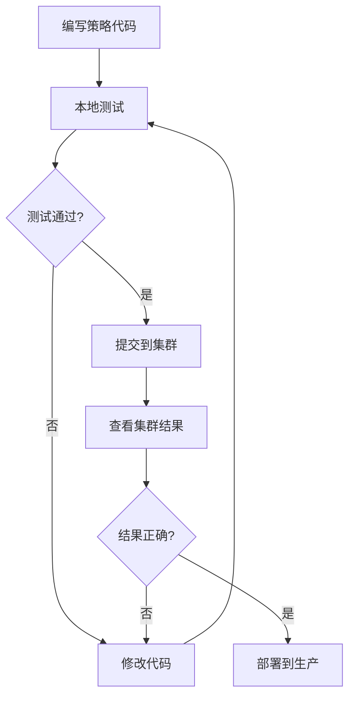

# 本地策略测试指南

## 简介

`local_test.py` 是一个本地测试工具，让交易员在提交任务到 Kubernetes 集群之前，先在本地验证策略代码是否正确。

## 优势

- ✅ **快速迭代**：无需等待镜像构建和 Pod 启动
- ✅ **即时反馈**：几秒钟内看到结果，而不是几分钟
- ✅ **节省资源**：避免浪费集群计算资源
- ✅ **调试方便**：可以直接在本地 IDE 中打断点调试
- ✅ **降低成本**：减少测试失败的次数

## 环境准备

### 1. 安装依赖

```bash
cd /path/to/quant-platform
pip install -r requirements.txt
```

### 2. 配置 OSS 环境变量

```bash
export OSS_ACCESS_KEY_ID='your_access_key_id'
export OSS_ACCESS_KEY_SECRET='your_access_key_secret'
export OSS_ENDPOINT='https://oss-cn-hangzhou-internal.aliyuncs.com'
export OSS_DATA_BUCKET='quant-mdl-data'  # 可选，默认值就是这个
```

或者创建一个 `.env` 文件：

```bash
# .env
OSS_ACCESS_KEY_ID=your_access_key_id
OSS_ACCESS_KEY_SECRET=your_access_key_secret
OSS_ENDPOINT=https://oss-cn-hangzhou-internal.aliyuncs.com
OSS_DATA_BUCKET=quant-mdl-data
```

然后使用 `source .env` 加载。

## 使用方法

### 基本用法

```bash
# 测试单日、指定股票
python local_test.py strategy.py --date 20250106 --codes "000001.SZ,000002.SZ"

# 测试日期范围、指定股票
python local_test.py strategy.py --date 20250106-20250110 --codes "000001.SZ,600000.SH"

# 测试全市场模式（仅前10只股票）
python local_test.py strategy.py --date 20250106 --all

# 使用策略文件中定义的股票列表
python local_test.py strategy.py --date 20250106

# 显示详细日志
python local_test.py strategy.py --date 20250106 --codes "000001.SZ" -v

# 指定输出文件
python local_test.py strategy.py --date 20250106 --codes "000001.SZ" --output my_result.json
```

### 测试 TAQ 策略

```bash
# 测试 2 只股票，1 个交易日
python local_test.py taq_generator_strategy.py \
    --date 20250106 \
    --codes "000001.SZ,000002.SZ"

# 测试 5 个交易日
python local_test.py taq_generator_strategy.py \
    --date 20250106-20250110 \
    --codes "000001.SZ,000002.SZ"
```

### 输出示例

```
============================================================
🧪 本地策略测试
============================================================

📝 加载策略: taq_generator_strategy.py
   ✓ factor_info: {'market_count': 1, 'need_l1_tick': True, ...}
   ✓ securities: 2 只股票
   ✓ end_times: ['']

📅 测试日期: 20250106 ~ 20250106
   测试 2 只股票: ['000001.SZ', '000002.SZ']

🔌 连接 OSS: https://oss-cn-hangzhou-internal.aliyuncs.com
   Bucket: quant-mdl-data
   ✓ OSS 连接成功

⚙️  开始计算因子...

   ✓ 20250106 : 2 条记录

✅ 计算完成

📊 结果统计:
   总记录数: 2
   字段数: 245
   字段名: ['code', 'date', 'trd_cnt_1m_0931', ...]

   ✓ 所有字段都有有效值（前10条检查）

📋 样本数据（第1条）:
      code: 000001.SZ
      date: 20250106
      trd_cnt_1m_0931: 127.0000
      trd_qty_1m_0931: 2450.0000
      ...

💾 结果已保存到: ./local_test_result.json

============================================================
✅ 本地测试完成
============================================================
```

## 常见问题排查

### 1. 数据全是 NaN

**原因**：属性名错误

```python
# ❌ 错误
tick = stock_data.tick
deal = stock_data.deal

# ✅ 正确
tick = stock_data.l1_tick
deal = stock_data.l2_deal
```

### 2. 没有任何结果

**可能原因**：
- 日期没有数据（周末、节假日）
- 股票代码不存在或格式错误
- `factor_calculation` 函数返回了 `None`

### 3. OSS 连接失败

**检查**：
- 环境变量是否正确设置
- 网络是否可以访问 OSS endpoint
- AccessKey 是否有效

### 4. 加载策略失败

**检查**：
- 策略文件语法是否正确
- 是否定义了 `factor_calculation` 函数
- 是否定义了 `factor_info` 字典

## 开发流程建议



**推荐步骤**：

1. **编写策略代码**
2. **本地测试单日单股票**：`--date 20250106 --codes "000001.SZ"`
3. **本地测试多日多股票**：`--date 20250106-20250110 --codes "000001.SZ,000002.SZ"`
4. **检查结果是否符合预期**（没有 NaN，数值合理）
5. **提交到集群测试**：小规模任务（3-5 只股票）
6. **集群测试通过后**：提交完整批次任务

## 高级用法

### 自定义输出处理

可以修改 `collect_result` 函数来自定义输出处理：

```python
def collect_result(date, end_time, data):
    if data is not None and not data.empty:
        # 自定义处理逻辑
        print(f"Processing {date}: {len(data)} records")
        # 可以在这里添加额外的验证、统计等
```

### 集成到 CI/CD

```bash
#!/bin/bash
# test_strategy.sh

# 运行本地测试
python local_test.py strategy.py --date 20250106 --codes "000001.SZ"

# 检查退出码
if [ $? -eq 0 ]; then
    echo "✅ 策略测试通过，可以提交"
else
    echo "❌ 策略测试失败，请修复错误"
    exit 1
fi
```

## 注意事项

1. **数据量控制**：本地测试建议使用少量股票和短时间范围，避免内存不足
2. **网络要求**：需要能访问 OSS（内网或 VPN）
3. **环境一致性**：确保本地 Python 版本和依赖与集群一致
4. **全市场模式**：本地测试全市场时只测试前 10 只股票，实际提交会处理全部

## 相关文件

- `local_test.py` - 本地测试工具
- `submit_taq_batches.py` - 批次任务提交工具
- `taq_generator_strategy.py` - TAQ 策略示例
- `CLAUDE.md` - 项目关键信息文档
